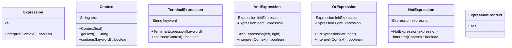

# Patrón Interpreter - Validador de Cláusulas de Arrendamiento

Sistema de validación automática de cláusulas legales usando el patrón de diseño Interpreter.

## 📋 Descripción

Una firma inmobiliaria digital necesita validar automáticamente que las cláusulas de pago en contratos de arrendamiento estén correctamente redactadas antes de su aprobación. 

Este sistema utiliza el **patrón Interpreter** para construir un Abstract Syntax Tree (AST) que valida la estructura gramatical de las cláusulas sin necesidad de condicionales extensos ni lógica centralizada.

## 🎯 Patrón Interpreter Aplicado

### Componentes
```
Expression (Interface)
    ├── TerminalExpression (hoja)
    └── Non-Terminal Expressions (nodos compuestos)
        ├── AndExpression
        ├── OrExpression
        └── NotExpression
```

### Reglas de Validación

Una cláusula válida debe contener:

1. **Sujeto:** Arrendatario o Inquilino
2. **Acción:** Pagará o Abonará
3. **Complemento 1 (Objeto):** Renta o Canon
4. **Complemento 2 (Tiempo):** Mensual o Anticipado
5. **Prohibición:** NO debe contener "subarrendar"

## 🏗️ Arquitectura

### Abstract Syntax Tree (AST)
```
                    AND
                   /   \
                AND     NOT (subarrendar)
               /   \
            AND     AND
           /   \   /   \
          OR   OR OR   OR
         /  \ /  \ |    |
    Sujetos Acciones Complementos
```

### Estructura del Proyecto
```
src/
├── expression/
│   └── Expression.java           # Interface base
├── terminal/
│   └── TerminalExpression.java   # Expresión hoja (palabras clave)
├── nonterminal/
│   ├── AndExpression.java        # Operador lógico AND
│   ├── OrExpression.java         # Operador lógico OR
│   └── NotExpression.java        # Operador lógico NOT
├── context/
│   └── Context.java              # Contexto (texto a validar)
└── Main.java                     # Punto de entrada
```

## 🚀 Cómo ejecutar

### Compilar
```bash
javac -d bin src/**/*.java src/*.java
```

### Ejecutar
```bash
java -cp bin Main
```

### Desde IDE

1. Importa el proyecto en IntelliJ IDEA o Eclipse
2. Ejecuta la clase `Main.java`

## 📊 Casos de Prueba

### ✅ Caso 1: Cláusula Válida

**Input:** `"El arrendatario pagará la renta mensual"`

**Resultado:** ✓ VALID CLAUSE

**Razón:** Contiene todos los elementos requeridos


### ✅ Caso 2: Cláusula Válida con Sinónimos

**Input:** `"El inquilino abonará el canon anticipado"`

**Resultado:** ✓ VALID CLAUSE

**Razón:** Usa sinónimos válidos (inquilino, abonará, canon, anticipado)


### ❌ Caso 3: Cláusula Inválida - Falta Acción

**Input:** `"El arrendatario la renta mensual"`

**Resultado:** ✗ INVALID CLAUSE

**Razón:** No contiene verbo de acción (pagará/abonará)


### ❌ Caso 4: Cláusula Inválida - Palabra Prohibida

**Input:** `"El arrendatario pagará la renta mensual y podrá subarrendar"`

**Resultado:** ✗ INVALID CLAUSE

**Razón:** Contiene la palabra prohibida "subarrendar"


### ❌ Caso 5: Cláusula Inválida - Faltan Complementos

**Input:** `"El arrendatario pagará"`

**Resultado:** ✗ INVALID CLAUSE

**Razón:** Faltan complementos obligatorios (objeto y tiempo)

## 📐 Diagrama UML


## 🎓 Conceptos Clave

### Expression (Interface)

Define el contrato que todas las expresiones deben cumplir:
- Método `interpret(Context)` que retorna `boolean`

### TerminalExpression

Expresión hoja del árbol que valida la existencia de una palabra clave específica en el texto.
```java
new TerminalExpression("arrendatario")
```

### Non-Terminal Expressions

#### AndExpression

Evalúa a `true` solo si **ambas** expresiones son verdaderas.
```java
new AndExpression(subject, action)
```

#### OrExpression

Evalúa a `true` si **al menos una** expresión es verdadera.
```java
new OrExpression(
    new TerminalExpression("arrendatario"),
    new TerminalExpression("inquilino")
)
```

#### NotExpression

Niega el resultado de una expresión (operador lógico NOT).
```java
new NotExpression(new TerminalExpression("subarrendar"))
```

## ✨ Ventajas del Patrón Interpreter

### Sin Patrón (Antes)
```java
public boolean validate(String text) {
    if (text.contains("arrendatario") || text.contains("inquilino")) {
        if (text.contains("pagará") || text.contains("abonará")) {
            if (text.contains("renta") || text.contains("canon")) {
                if (text.contains("mensual") || text.contains("anticipado")) {
                    if (!text.contains("subarrendar")) {
                        return true;
                    }
                }
            }
        }
    }
    return false;
}
```

❌ Difícil de mantener  
❌ No escalable  
❌ Lógica acoplada  

### Con Patrón (Después)
```java
Expression validator = new AndExpression(
    new AndExpression(subject, action),
    new AndExpression(complement1, complement2)
);
```

✅ Fácil de extender  
✅ Separación de responsabilidades  
✅ Composición sobre condicionales  

## 🔧 Extensibilidad

### Agregar Nueva Expresión (XOR)
```java
public class XorExpression implements Expression {
    private Expression left;
    private Expression right;
    
    public XorExpression(Expression left, Expression right) {
        this.left = left;
        this.right = right;
    }
    
    @Override
    public boolean interpret(Context context) {
        boolean leftResult = left.interpret(context);
        boolean rightResult = right.interpret(context);
        return leftResult ^ rightResult; // XOR lógico
    }
}
```

### Agregar Nuevas Palabras Clave
```java
Expression newSubject = new OrExpression(
    new OrExpression(
        new TerminalExpression("arrendatario"),
        new TerminalExpression("inquilino")
    ),
    new TerminalExpression("locatario") // Nueva palabra
);
```

## 📚 Requisitos Cumplidos

- ✅ Crear expresiones simples que validen palabras clave
- ✅ Encadenar estructura mediante operadores lógicos (AND, OR)
- ✅ Procesar textos mediante árbol de expresiones
- ✅ Agregar nuevos operadores sin modificar existentes
- ✅ No centralizar lógica en una sola clase
- ✅ No usar condicionales externos (todo fluye por `interpret()`)
- ✅ Relación mediante composición
- ✅ Cliente no conoce clases específicas (usa `Expression`)
- ✅ Clase base abstracta/interfaz (`Expression`)

## 👨‍💻 Autor

**Javier Rodríguez**  
Código: 20231020172  
Universidad Distrital Francisco José de Caldas  
Modelos de Programación